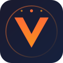

# OpenViking Memory for ZCode

[](LICENSE)
[]()
[]()

Long-term semantic memory for [ZCode](https://zcode.z.ai), powered by [OpenViking](https://github.com/volcengine/OpenViking). Auto-recall relevant memories on every prompt, auto-capture important facts from every turn — no MCP tool calls required from the model.



> A faithful ZCode port of the [OpenViking Claude Code memory plugin](https://github.com/volcengine/OpenViking/tree/main/examples/claude-code-memory-plugin), adapted for ZCode's plugin format, hook events, and template variables.

## ✨ Features

- **Auto-recall** — relevant memories are injected into every prompt via `<openviking-context>` blocks
- **Auto-capture** — conversations are pushed to OpenViking in the background on `Stop` and `SessionEnd`
- **Smart redirect** — `PreToolUse(Read|Glob|Grep)` hook intercepts attempts to read `viking://...` URIs from the local filesystem and redirects to MCP tools
- **Slash commands** — `/ov <subcommand>` and `/ov-status` for explicit control
- **Skill** — `openviking-usage` auto-loads and teaches the model best-practice OpenViking usage
- **Workspace peer isolation** — each project gets its own memory scope, plus global memory
- **Async writes** — capture runs in a detached worker so the user never waits
- **MCP discovery** — auto-detects the OpenViking MCP server from your ZCode config
- **Cross-platform** — pure Node.js, no native deps, runs on Windows / macOS / Linux

## 📦 Install

### 1. Make sure the OpenViking server is running

```bash
# Local (default)
curl http://127.0.0.1:1933/mcp   # should return 406 (the MCP handshake)

# Or a remote server — see "Configuration" below
```

### 2. Install the plugin from ZCode

In ZCode, open **Settings → Plugin Management → Discover** and click **`+`** to add a marketplace:

- **Option A**: paste this repo URL → `https://github.com/SOMM-55/zcode-openviking-plugin.git`
- **Option B**: add the local directory `C:\Users\OMID\Code\openviking-memory` (during development)

Then install the `openviking-memory` plugin from the **Discover** tab.

### 3. Add the OpenViking MCP server (if not already)

In `~/.zcode/cli/config.json` under `mcp.servers`:

```json
{
  "mcp": {
    "servers": {
      "openviking": {
        "type": "http",
        "url": "http://127.0.0.1:1933/mcp",
        "timeoutMs": 60000
      }
    }
  }
}
```

The plugin auto-discovers the `openviking` MCP server entry at runtime and reuses its URL and auth headers. No need to configure the same thing twice.

### 4. Restart ZCode

Hooks, commands, and skills are loaded at session start.

## 🚀 Usage

### Slash commands

| Command | What it does |
|---|---|
| `/ov health` | Server liveness check |
| `/ov status` | One-line status |
| `/ov remember <text>` | Store a memory |
| `/ov recall <query>` | Type-quota memory recall |
| `/ov find <query>` | Fast semantic find |
| `/ov search <query>` | Deep semantic search |
| `/ov read <uri>` | Read a `viking://` URI |
| `/ov list <uri>` | List a `viking://` directory |
| `/ov glob <pattern>` | Filename glob |
| `/ov grep <uri> <re>` | Regex content search |
| `/ov forget <uri>` | Permanently delete (irreversible) |
| `/ov setup` | Re-run the setup wizard |
| `/ov-status` | Short status (alias) |

### Automatic behavior

- **Before each prompt**: `auto-recall` searches OpenViking for relevant memories and injects them as a `<openviking-context>` block. The model sees them as context.
- **After each stop**: `auto-capture` parses the conversation, strips pollution blocks (prior `<openviking-context>`, `<system-reminder>`, etc.), and pushes the new turns to OpenViking. Runs in a detached worker so you never wait.
- **On `PreToolUse(Read|Glob|Grep)`**: `uri-guard` intercepts attempts to read `viking://...` URIs from the local filesystem and tells the model to use the OpenViking MCP tools instead.

### Direct MCP tools

You can also call the OpenViking tools directly:

```
mcp__openviking__remember({ messages: [{ role: "user", content: "..." }] })
mcp__openviking__find({ query: "..." })
mcp__openviking__read({ uris: ["viking://user/default/memories/identity.md"] })
```

## ⚙️ Configuration

The plugin reads configuration in this priority order (highest wins):

1. **Environment variables** (`OPENVIKING_*`)
2. **MCP discovery** — the `openviking` MCP server entry in `~/.zcode/cli/config.json`
3. **`~/.zcode/openviking/config.json`** — plugin-specific overrides
4. **Built-in defaults** — `http://127.0.0.1:1933`, no auth

### Common environment variables

| Var | Default | Purpose |
|---|---|---|
| `OPENVIKING_URL` / `BASE_URL` | `http://127.0.0.1:1933` | Server URL |
| `OPENVIKING_API_KEY` / `BEARER_TOKEN` | _(none)_ | API key (sent as `Authorization: Bearer ...`) |
| `OPENVIKING_ACCOUNT` | _(none)_ | Multi-tenant account (`X-OpenViking-Account` header) |
| `OPENVIKING_USER` | _(none)_ | Multi-tenant user (`X-OpenViking-User` header) |
| `OPENVIKING_PEER_ID` | _(workspace-derived)_ | Override the workspace peer |
| `OPENVIKING_WORKSPACE_PEER` | `true` | Set `0` to disable peer derivation |
| `OPENVIKING_AUTO_RECALL` | `true` | Toggle auto-recall on `UserPromptSubmit` |
| `OPENVIKING_AUTO_CAPTURE` | `true` | Toggle auto-capture on `Stop` |
| `OPENVIKING_RECALL_LIMIT` | `6` | Max memories injected per turn |
| `OPENVIKING_RECALL_TOKEN_BUDGET` | `2000` | Inline content budget |
| `OPENVIKING_SCORE_THRESHOLD` | `0.35` | Min relevance to inject |
| `OPENVIKING_DEBUG` | `false` | Write `~/.zcode/openviking/logs/zcode-hooks.log` |

## 🔧 Hooks

| Event | Script | What it does |
|---|---|---|
| `SessionStart` | `session-start.mjs` | Probe MCP; trigger setup wizard if missing |
| `UserPromptSubmit` | `auto-recall.mjs` | Search OV → rank → inject context |
| `PreToolUse` (Read\|Glob\|Grep) | `uri-guard.mjs` | Redirect `viking://` reads to MCP tools |
| `Stop` | `auto-capture.mjs` | Push new turns to OV (async-detached) |
| `PreCompact` | `pre-compact.mjs` | Synchronous commit before transcript mutates |
| `SessionEnd` | `session-end.mjs` | Final commit (async-detached) |

> **Note**: ZCode supports 7 hook events. The upstream Claude Code plugin also has `SubagentStart`/`SubagentStop` and `PostToolUse(Read)`, but ZCode does not support those events. `PreCompact` is registered but ZCode may not fire it on all builds.

## 🧪 Test

```bash
npm test              # 29 unit tests
node scripts/smoke.mjs    # live integration smoke (requires running OV server)
```

## 🐛 Troubleshooting

### Plugin doesn't appear in Settings → Plugin Management

- Make sure the marketplace was added with the correct path/URL
- Check `~/.zcode/v2/logs/$(date +%Y-%m-%d).log` for `ZCodeProtocolClientError`
- Verify the `.zcode-plugin/plugin.json` exists and is valid JSON

### `/ov health` returns "openviking server unreachable"

- Check the server: `curl http://127.0.0.1:1933/mcp`
- Verify the MCP entry in `~/.zcode/cli/config.json` matches what the plugin discovers
- Set `OPENVIKING_DEBUG=1` and check `~/.zcode/openviking/logs/zcode-hooks.log`

### `remember` returned but `find` doesn't show it

Extraction is async — wait 2-3 seconds. To check the raw transcript:

```bash
mcp__openviking__read({ uris: ["viking://user/default/sessions/<session-id>/messages.jsonl"] })
```

### `PreToolUse` uri-guard denies your tool call

The hook sees a `viking://...` URI in your tool input. Use the OpenViking MCP tool instead:

```
mcp__openviking__read({ uris: ["viking://..."] })
mcp__openviking__list({ uri: "viking://..." })
mcp__openviking__grep({ uri: "viking://...", pattern: ["..."] })
```

## 📁 Project structure

```
openviking-memory/
├── .zcode-plugin/
│   ├── plugin.json          # ZCode manifest
│   └── assets/logo.svg      # plugin icon
├── skills/
│   └── openviking-usage/
│       ├── SKILL.md
│       └── references/
│           ├── tools.md
│           ├── patterns.md
│           └── troubleshooting.md
├── commands/
│   ├── ov.md                # /ov <subcommand>
│   └── ov-status.md
├── hooks/
│   └── hooks.json
├── scripts/
│   ├── lib/                 # config, discovery, client, recall, capture, …
│   ├── session-start.mjs
│   ├── auto-recall.mjs
│   ├── auto-capture.mjs
│   ├── uri-guard.mjs
│   ├── pre-compact.mjs
│   ├── session-end.mjs
│   ├── setup-wizard.mjs
│   ├── ov.mjs               # /ov dispatcher
│   ├── ov-status.mjs
│   └── smoke.mjs
├── docs/
│   └── superpowers/
│       ├── specs/2026-07-29-openviking-memory-plugin-design.md
│       └── plans/2026-07-29-openviking-memory-plugin.md
├── README.md
├── CHANGELOG.md
├── CONTRIBUTING.md
├── LICENSE
└── package.json
```

## 📜 License

Apache-2.0 — same as [OpenViking](https://github.com/volcengine/OpenViking/blob/main/LICENSE).

## 🙏 Credits

- [OpenViking](https://github.com/volcengine/OpenViking) by Volcengine — the underlying MCP server
- The reference [Claude Code memory plugin](https://github.com/volcengine/OpenViking/tree/main/examples/claude-code-memory-plugin) whose architecture and env vars this port mirrors
- [ZCode](https://zcode.z.ai) — the AI client platform
